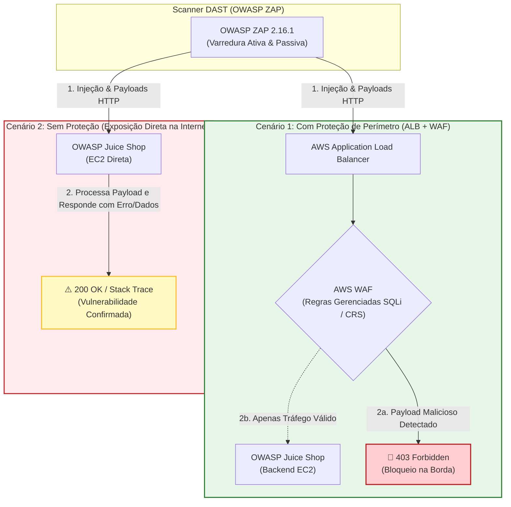

# 🛡️ OWASP Juice Shop: Análise de Segurança com OWASP ZAP (Com vs Sem WAF)

[](https://www.zaproxy.org/)
[](https://owasp.org/www-project-juice-shop/)
[](https://aws.amazon.com/waf/)
[](#)

Este repositório documenta e compara os resultados de testes de segurança de aplicações web (**DAST - Dynamic Application Security Testing**) executados com o **OWASP ZAP 2.16.1** sobre a aplicação intencionalmente vulnerável **OWASP Juice Shop**.

O laboratório compara dois cenários de arquitetura na nuvem AWS:
1. **Com Proteção:** Aplicação protegida por **AWS Application Load Balancer (ALB) com AWS WAF ativo**.
2. **Sem Proteção:** Aplicação acessada diretamente em instância EC2 **sem nenhuma proteção de WAF**.

---

## 📑 Sumário

- [1. Visão Geral do Laboratório](#1-visão-geral-do-laboratório)
- [2. Topologia e Arquitetura](#2-topologia-e-arquitetura)
- [3. Painel Comparativo Resumido](#3-painel-comparativo-resumido)
- [4. Análise dos Resultados](#4-análise-dos-resultados)
  - [Cenário 1: Com ALB + WAF (Protegido)](#cenário-1-com-alb--waf-protegido)
  - [Cenário 2: Sem WAF (Vulnerável)](#cenário-2-sem-waf-vulnerável)
- [5. Destaque: A Injeção SQL Mitigada pelo WAF](#5-destaque-a-injeção-sql-mitigada-pelo-waf)
- [6. Visualização Interativa do Relatório (Download)](#6-visualização-interativa-do-relatório-download)
- [7. Documentação Técnica Completa](#7-documentação-técnica-completa)
- [8. Estrutura de Arquivos no Repositório](#8-estrutura-de-arquivos-no-repositório)
- [9. Guia de Estudos e Perguntas para os Alunos](#9-guia-de-estudos-e-perguntas-para-os-alunos)
- [10. Boas Práticas e Conceitos-Chave](#10-boas-práticas-e-conceitos-chave)

---

## 1. Visão Geral do Laboratório

O objetivo principal deste laboratório é demonstrar, de forma prática e mensurável, a relevância da **segurança perimetral em camada de aplicação (Camada 7 - OSI)** provida por um **Web Application Firewall (WAF)** frente a varreduras ativas e passivas automatizadas de vulnerabilidades.

| Parâmetro | Cenário A: Com WAF | Cenário B: Sem WAF |
| :--- | :--- | :--- |
| **Alvo do Scan** | `http://juce-shop-alb-656313811.us-east-2.elb.amazonaws.com` | `http://juice-shop-ec2-sem-waf-2139686008.us-east-2.elb.amazonaws.com` |
| **Infraestrutura** | AWS Application Load Balancer (ALB) + AWS WAF | Instância AWS EC2 (Acesso Direto) |
| **Ferramenta DAST** | OWASP ZAP v2.16.1 | OWASP ZAP v2.16.1 |
| **Data do Teste** | 03/09/2025 às 23:01:58 | 03/09/2025 às 23:21:16 |
| **Total de Alertas** | **0** (Nenhum alerta) | **16 categorias** (194 ocorrências) |
| **Risco Máximo** | **Nenhum** | **Alto** (Injeção SQL) |

---

## 2. Topologia e Arquitetura

A figura abaixo ilustra a diferença de fluxo entre as duas abordagens testadas:



---

## 3. Painel Comparativo Resumido

Abaixo estão quantificados os alertas encontrados pelo scanner dinâmico em cada nível de severidade:

```
Nível de Risco        Com ALB + WAF      Sem WAF (VM Direta)
────────────────────────────────────────────────────────────
🔴 Alto                      0                  1 tipo (1 instância: Injeção SQL)
🟠 Médio                     0                  5 tipos (97 instâncias)
🟡 Baixo                     0                  6 tipos (74 instâncias)
🔵 Informativo               0                  4 tipos (22 instâncias)
────────────────────────────────────────────────────────────
TOTAL DE ALERTAS             0                 16 categorias (194 ocorrências)
```

> **Eficácia do WAF:** O AWS WAF mitigou **100%** dos alertas durante a execução do scan dentro dos parâmetros definidos. Ataques de sondagem de injeção foram interceptados e descartados antes de alcançarem o backend da aplicação.

---

## 4. Análise dos Resultados

### Cenário 1: Com ALB + WAF (Protegido)

No relatório gerado para o endpoint com ALB e WAF:
- **Status do Scanner:** *"No alerts were found within the report parameters."*
- **Comportamento Observado:**
  - O AWS WAF analisou as assinaturas e comportamentos das requisições geradas pelos plugins do ZAP (como `Active Scanner: SQL Injection`).
  - Ao identificar padrões de injeção (`'`, `"`, `--`, `UNION`, `SELECT`), o WAF respondeu imediatamente com código **HTTP 403 Forbidden**.
  - Como o backend não respondeu com erros de sintaxe SQL, tempos de espera anômalos ou reflexões de dados, o ZAP concluiu que o alvo não era vulnerável.

### Cenário 2: Sem WAF (Vulnerável)

No endpoint sem WAF, o scanner teve acesso livre à aplicação e mapeou **16 tipos de vulnerabilidades e más configurações**:

| Categoria de Risco | Vulnerabilidade / Alerta | CWE | Ocorrências | Impacto Principal |
| :--- | :--- | :--- | :---: | :--- |
| 🔴 **Alto** | **Injeção SQL** | [CWE-89](https://cwe.mitre.org/data/definitions/89.html) | 1 | Extração de banco de dados, bypass de autenticação e RCE potencial |
| 🟠 **Médio** | **Configuração Incorreta Entre Domínios (CORS)** | [CWE-264](https://cwe.mitre.org/data/definitions/264.html) | 34 | Vazamento de dados para origens não autorizadas via browser |
| 🟠 **Médio** | **Content Security Policy (CSP) Ausente** | [CWE-693](https://cwe.mitre.org/data/definitions/693.html) | 13 | Facilita a execução de Cross-Site Scripting (XSS) e injeção de scripts |
| 🟠 **Médio** | **Anti-clickjacking Header Ausente** | [CWE-1021](https://cwe.mitre.org/data/definitions/1021.html) | 8 | Permite que a aplicação seja emoldurada em iframes maliciosos (UI Redressing) |
| 🟠 **Médio** | **Session ID in URL Rewrite** | [CWE-598](https://cwe.mitre.org/data/definitions/598.html) | 31 | IDs de sessão expostos em URLs, logs e histórico do navegador |
| 🟠 **Médio** | **Vulnerable JS Library** | [CWE-1395](https://cwe.mitre.org/data/definitions/1395.html) | 1 | Bibliotecas frontend legadas com CVEs públicas conhecidas |
| 🟡 **Baixo** | **Cross-Domain JS Source Inclusion** | [CWE-829](https://cwe.mitre.org/data/definitions/829.html) | 2 | Inclusão de scripts externos sem verificação de integridade (SRI) |
| 🟡 **Baixo** | **Vazamento de Data/Hora (Unix Timestamp)** | [CWE-497](https://cwe.mitre.org/data/definitions/497.html) | 4 | Informações internas de temporização expostas para reconhecimento |
| 🟡 **Baixo** | **Vazamento de IP Privado** | [CWE-497](https://cwe.mitre.org/data/definitions/497.html) | 2 | Endereços IP de rede interna expostos nos cabeçalhos/corpo |
| 🟡 **Baixo** | **Vazamento de Versão no Cabeçalho `Server`** | [CWE-497](https://cwe.mitre.org/data/definitions/497.html) | 44 | Identificação de software e versões do servidor para ataques direcionados |
| 🟡 **Baixo** | **Strict-Transport-Security (HSTS) Ausente** | [CWE-319](https://cwe.mitre.org/data/definitions/319.html) | 10 | Risco de downgrade para HTTP inseguro e ataques Man-in-the-Middle |
| 🟡 **Baixo** | **X-Content-Type-Options Ausente** | [CWE-693](https://cwe.mitre.org/data/definitions/693.html) | 15 | Risco de MIME-sniffing pelo navegador |
| 🔵 **Informativo** | **Comentários Suspeitos no Código** | [CWE-615](https://cwe.mitre.org/data/definitions/615.html) | 1 | Comentários de desenvolvedores contendo pistas estruturais |
| 🔵 **Informativo** | **Modern Web Application** | N/A | 1 | Identificação de tecnologias SPA/AJAX |
| 🔵 **Informativo** | **Diretivas de Cache-Control** | [CWE-525](https://cwe.mitre.org/data/definitions/525.html) | 27 | Dados potencialmente sensíveis cacheados em proxies/navegadores |
| 🔵 **Informativo** | **Retrieved from Cache** | [CWE-525](https://cwe.mitre.org/data/definitions/525.html) | 1 | Respostas recuperadas diretamente de cache intermediário |

---

## 5. Destaque: A Injeção SQL Mitigada pelo WAF

A evidência mais crítica encontrada pelo ZAP no ambiente desprotegido foi a injeção SQL no endpoint da API REST de busca de produtos:

```http
GET http://3.22.70.177/juice-shop/rest/products/search?q=%27%28 HTTP/1.1
Host: 3.22.70.177
User-Agent: Mozilla/5.0 (Windows NT 10.0; Win64; x64; rv:142.0) Gecko/20100101 Firefox/142.0
Accept: application/json, text/plain, */*
Connection: keep-alive
Referer: http://3.22.70.177/juice-shop/
```

- **Parâmetro Afetado:** `q` (Query string)
- **Payload Injetado:** `q='%28` (onde `%28` representa o caractere `(` precedido por aspas simples `'`)
- **Evidência no Scanner:** A aplicação respondeu de modo anômalo, confirmando que a entrada do usuário foi concatenada diretamente na consulta SQL sem sanitização ou parametrização (*Prepared Statements*).
- **Como o WAF atuou no Cenário 1:** As regras gerenciadas do AWS WAF (`AWSManagedRulesSQLiRuleSet` e `AWSManagedRulesCommonRuleSet`) identificaram a presença de caracteres e operadores típicos de injeção no parâmetro de busca e abortaram a requisição na borda (*edge*), impedindo que ela chegasse ao banco SQLite do Juice Shop.

---

## 6. Visualização Interativa do Relatório (Download)

Para uma experiência visual e interativa completa (com painel comparativo executivo e navegação dinâmica por abas entre os dois cenários), disponibilizamos o relatório consolidado em página única:

👉 **[Juice-shop Relatorio Unificado.html](https://github.com/LeandroOSBr/juice-shop/blob/master/RELATORIO/Juice-shop%20Relatorio%20Unificado.html)**

### 📥 Instruções para os Alunos:
Como o GitHub exibe apenas o código-fonte puro de arquivos HTML para segurança, siga o passo a passo abaixo para visualizar o relatório completo renderizado:

1. Acesse o link: **[Juice-shop Relatorio Unificado.html](https://github.com/LeandroOSBr/juice-shop/blob/master/RELATORIO/Juice-shop%20Relatorio%20Unificado.html)**.
2. Na interface do GitHub, localize o botão **Download raw file** (ícone da seta para baixo ⬇️ no canto superior direito do visualizador de código).
3. Salve o arquivo em seu computador.
4. Abra o arquivo baixado com um **duplo clique** utilizando qualquer navegador moderno (Google Chrome, Microsoft Edge, Mozilla Firefox, Brave, etc.).
5. **Vantagem Single-File:** O arquivo é 100% autônomo! Todos os estilos CSS e imagens estão embutidos em Base64, funcionando perfeitamente mesmo sem conexão à internet e sem necessidade de pastas externas.

---

## 7. Documentação Técnica Completa

Para uma análise detalhada de cada uma das 16 vulnerabilidades, incluindo explicação conceitual, trechos de código vulnerável, correção recomendada e regras de mitigação no WAF, consulte:

👉 **[RELATORIO_TECNICO_DETALHADO.md](./RELATORIO_TECNICO_DETALHADO.md)**

---

## 8. Estrutura de Arquivos no Repositório

```text
├── README.md                              <- Este documento didático principal
├── RELATORIO_TECNICO_DETALHADO.md         <- Guia exaustivo de cada vulnerabilidade, código e remediação
├── Juice-shop Relatorio Unificado.html    <- Relatório interativo em arquivo único (Dashboard + Abas)
├── Juice-shop com ALB + WAF.html          <- Relatório HTML original individual (Com WAF)
└── Juice-shop sem WAF.html                <- Relatório HTML original individual (Sem WAF)
```

---

## 9. Guia de Estudos e Perguntas para os Alunos

Use as questões abaixo em sala de aula, relatórios acadêmicos ou grupos de estudo:

### Questão 1: O papel do WAF na segurança de aplicações
> *O fato de o relatório "Com ALB + WAF" ter apresentado 0 alertas significa que o código-fonte da aplicação Juice Shop é seguro? Explique o conceito de "Falsa Sensação de Segurança" e o princípio da **Defesa em Profundidade (Defense in Depth)**.*

### Questão 2: Vulnerabilidade vs Mitigação
> *Considere a vulnerabilidade de Injeção SQL identificada no endpoint `/rest/products/search?q=...`:*
> - *a) Como um desenvolvedor deve corrigir essa vulnerabilidade no código-fonte?*
> - *b) Por que colocar um WAF na frente é considerado uma medida de mitigação perimetral e não uma correção definitiva?*

### Questão 3: Cabeçalhos de Segurança HTTP
> *Das 16 vulnerabilidades detectadas sem WAF, diversas estão relacionadas à ausência de cabeçalhos de resposta HTTP (`Content-Security-Policy`, `X-Frame-Options`, `Strict-Transport-Security`, `X-Content-Type-Options`).*
> - *a) Como a ausência do cabeçalho `X-Frame-Options` possibilita um ataque de Clickjacking?*
> - *b) Seria possível configurar o próprio Application Load Balancer (ALB) ou CloudFront para injetar esses cabeçalhos sem alterar o código da aplicação?*

### Questão 4: Teste DAST Ativo vs Passivo
> *No relatório do ZAP, observe que a Injeção SQL foi encontrada por um **Active Scanner**, enquanto a falta de CSP e vazamento de versão foram encontrados por um **Passive Scanner**.*
> - *Qual é a diferença operacional e de impacto entre um scanner passivo e um scanner ativo durante um teste de invasão?*

---

## 10. Boas Práticas e Conceitos-Chave

- **DAST (Dynamic Application Security Testing):** Análise do tipo "caixa-preta" que avalia a aplicação em tempo de execução, enviando requisições e inspecionando respostas reais.
- **O WAF não substitui o código seguro:** Se um atacante descobrir um *bypass* de WAF (evasão por codificação, fragmentação de payload ou polimorfismo), a aplicação desprotegida no código continuará vulnerável.
- **Consultas Parametrizadas (Prepared Statements):** A única solução definitiva contra Injeção SQL é separar a estrutura do comando dos dados do usuário.
- **Hardening de Cabeçalhos HTTP:** Configurar o servidor web (Nginx/Apache/Node.js) ou CDN/ALB para retornar cabeçalhos modernos de segurança (`CSP`, `HSTS`, `X-Frame-Options`, `X-Content-Type-Options: nosniff`).
- **Camada de WAF Ativa:** Manter regras gerenciadas atualizadas (AWS Managed Rules, OWASP Core Rule Set) com monitoramento e bloqueio contínuo.

---

*Material didático desenvolvido para capacitação prática em Segurança de Aplicações Web (AppSec).*
